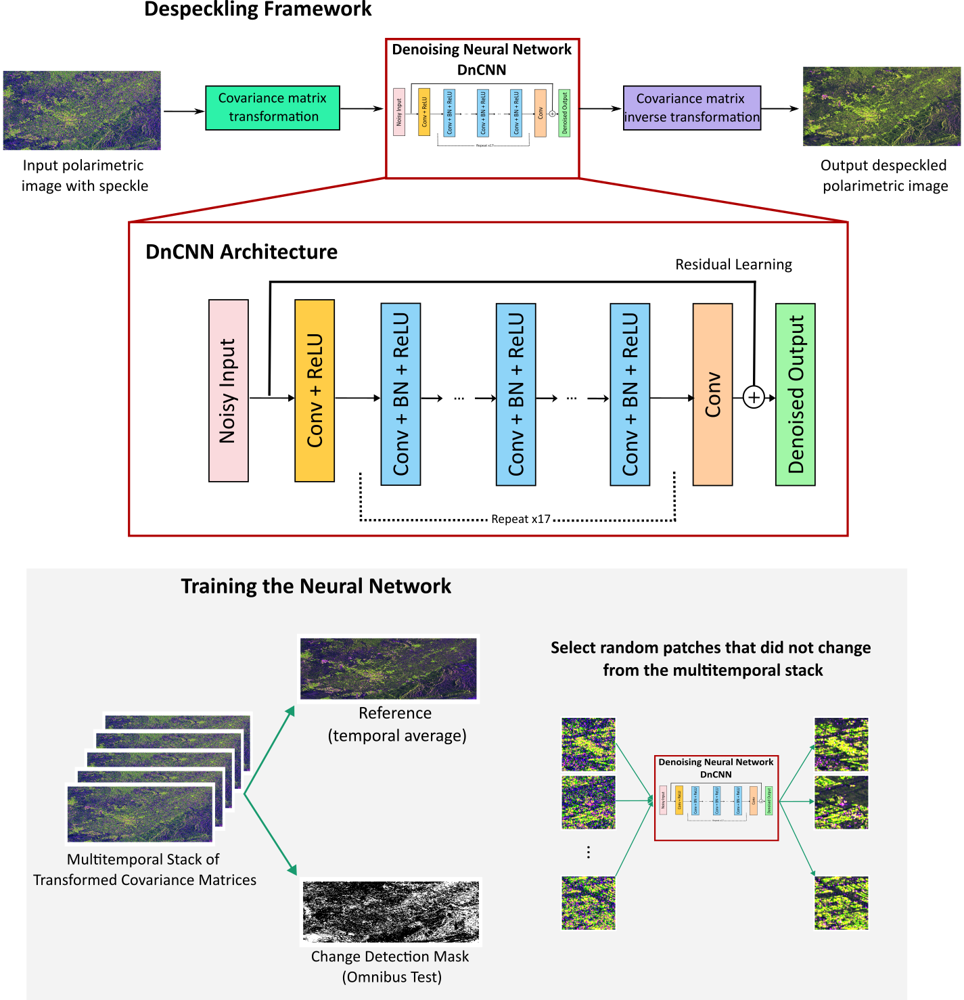
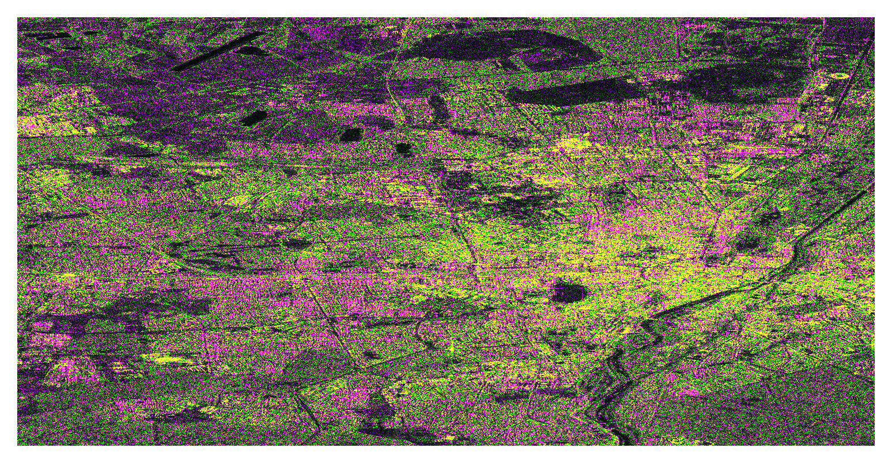
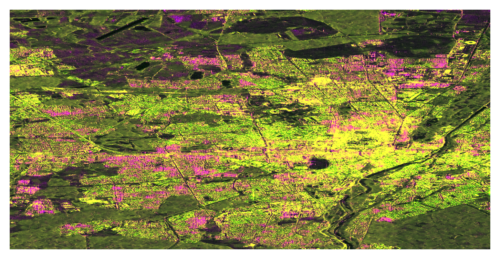

# Deep Learning Based Speckle Filtering for Polarimetric SAR Images. Application to Sentinel-1
## Alejandro Mestre-Quereda and Juan M. López-Sánchez. University of Alicante.

## Abstract
Speckle suppression in synthetic aperture radar (SAR) images is a key processing step which continues to be a research topic. A wide variety of methods, using either spatially-based approaches or transform-based strategies, have been developed and have shown to provide outstanding results. However, recent advances in deep learning techniques and their application to SAR image despeckling have been demonstrated to offer state-of-the-art results. Unfortunately, they have been mostly applied to single-polarimetric images. The extension of a deep learning-based approach for speckle removal to polarimetric SAR (PolSAR) images is complicated because of the complex nature of the measured covariance matrices for every image pixel, the properties of which must be preserved during filtering. In this work, we propose a complete framework to remove speckle in polarimetric SAR images using a convolutional neural network. The methodology includes a reversible transformation of the original complex covariance matrix to obtain a set of real-valued intensity bands which are fed to the neural network. In addition, the proposed method includes a change detection strategy to avoid the neural network to learn erroneous features in areas strongly affected by temporal changes, so that the network only learns the underlying speckle component present in the data. The method is implemented and tested with dual-polarimetric images acquired by Sentinel-1. Experiments show that the proposed approach offers exceptional results in both speckle reduction and resolution preservation. More importantly, it is also shown that the neural network is not generating artifacts or introducing bias in the filtered images, making them suitable for further polarimetric processing and exploitation. 

### General Scheme

### Example (Before and After Filtering)
R = VV, G = VH, B = VV/VH

### Usage
Complete testing/filtering code is provided in "test.py" file. 

Example of a Sentinel-1 dual-pol VV/VH image in SSC (complex) format is included in the /data folder (images are stored in a numpy array).

The provided testing code reads the image, generates a modified version of the dual-pol covariance matrix having four real-valued intensities and filters all bands using the weights of the trained CNN, which are also provided ("DS_DnCNN_3TS_sumse.h5").

### Resources
Paper Arxiv

Submitted to IEEE TGRS

### License
The material is made available under the GNU General Public License v3.0: Copyright 2024, Alejandro Mestre Quereda, Juan Manuel López Sánchez, of SST Research Group - University of Alicante. All rights reserved.
